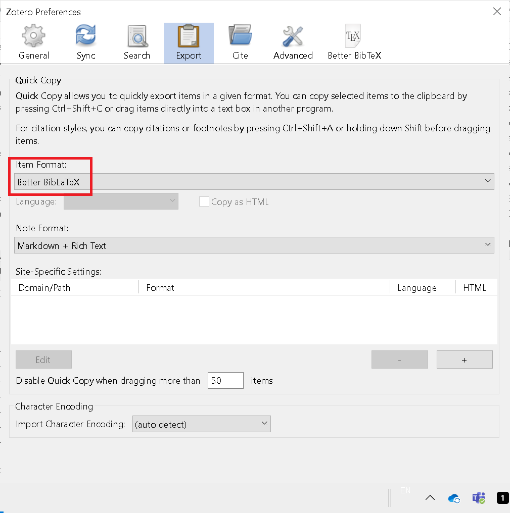
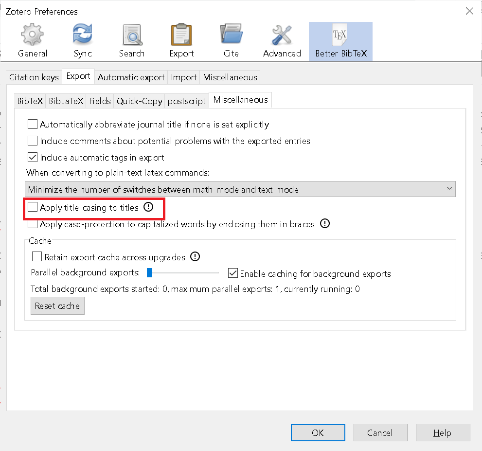
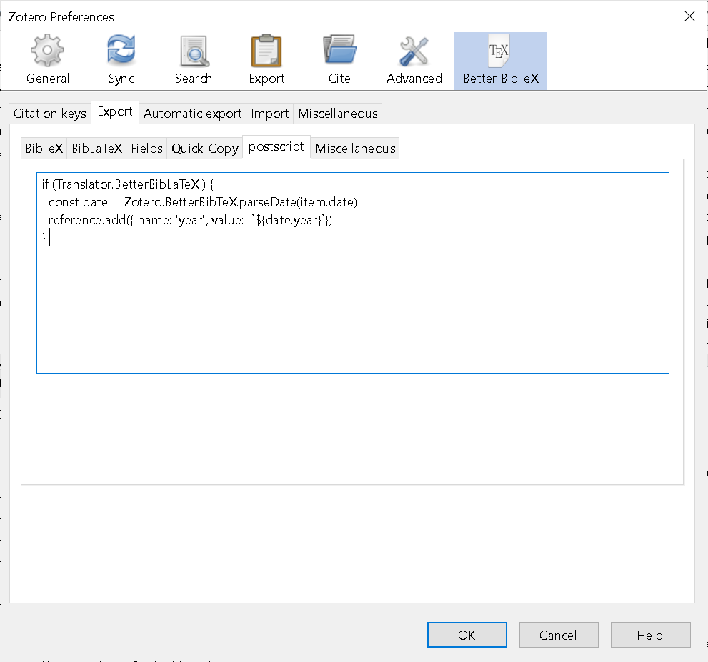
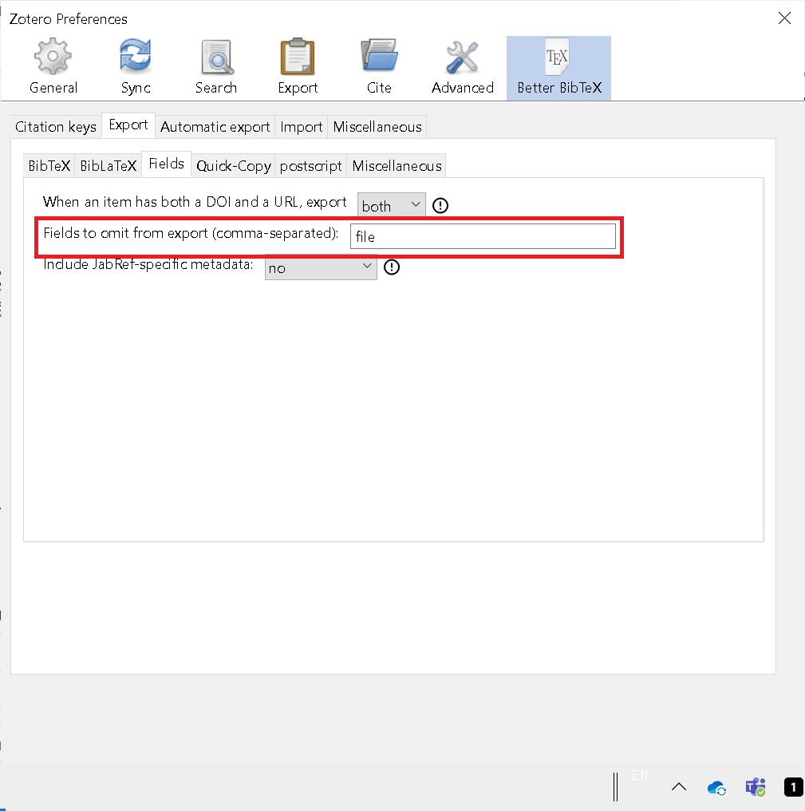
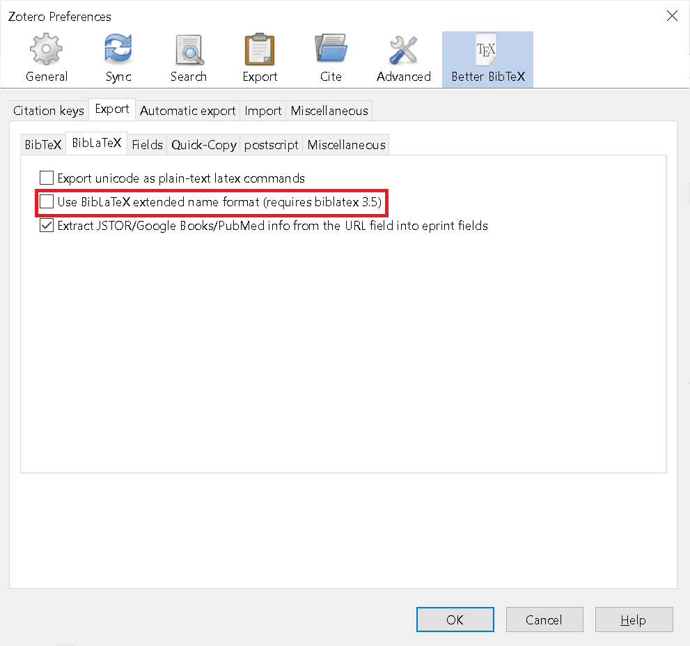
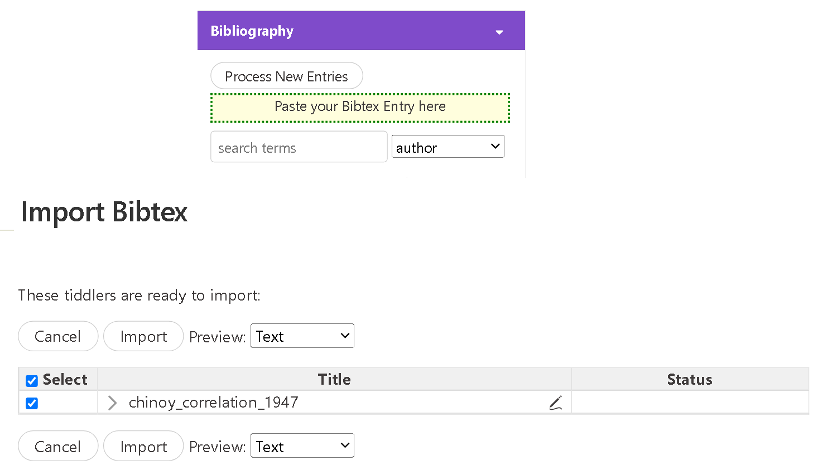

[Zotero](https://www.zotero.org/) is a free and open-source reference management software to manage bibliographic data and related research materials. [Better BibTeX (BBT)](https://retorque.re/zotero-better-bibtex/) is an extension for Zotero and Juris-M that makes it easier to manage bibliographic data. [Refnotes](https://kookma.github.io/TW-Refnotes/) is a [Tiddlywiki](https://tiddlywiki.com/) plugin to create and manage footnotes, abbreviations, citations, and references.

Tiddlywiki and Refnotes use `bibtex` to mange references. A few setting of Zotero and BBT should be changed to export correct format for Refnotes.

## Config Zotero and BBT

The export format `better BibTex` escapes specially character in the authors in default, `better BibLaTex` doesn't escape in default. So I suggest to use `Better BibLaTex` as export format. The `Quick Copy` can be set to `Better BibLaTex` format, then use shortcut `Ctrl + Shift + C` to quick copy BibTex into clipboard, then paste into Tiddlywiki.



`Better BibLaTex` use the quotation for title case in default, which can be disabled in the setting `Apply title case in titles`.




No `year` field is exported in `Better BibLaTex` format. The post script can be used to export `year`. Add new field `zotero-key` to create a link with Zotero protocol (e.g.zotero://select/items/0_ZKCXPRFN) which can open the same item in Zotero.

```
if (Translator.BetterBibLaTeX ) {
  const date = Zotero.BetterBibTeX.parseDate(item.date)
  reference.add({ name: 'year', value:  `${date.year}`})
  reference.add({ name: 'zotero-key', value: item.itemKey })
} 
```




The `file` field can be ignored in the setting if TiddlyWiki is published in public and you don't want to expose your local file path.



Disable `Use BibLaTex extended name format` in the export option `BibLaTex` to stop `prefix` for authors, e.g. `family=Linden, given=C. Gerard, prefix=van der, useprefix=true`.



## Export bibtex to Refnotes

After downloading references into Zotero, bibtex can be exported into Refnotes and tiddlywiki with following steps.

* Find the reference which will be used in tiddlywiki, and then copy the `Citation Key` (e.g. `chinoy_correlation_1947`) into clipboard.
* Use ref macro to cite reference (i.e. `<< ref chinoy_correlation_1947>>`)  in the tiddler, and save the tiddler. 
* If an error is shown in the reference list (`Reference chinoy_correlation_1947 NOT FOUND. Check your input.`) 
  * Go back to Zotero and use shortcut `Ctrl + Shift + C` to quickly copy `Better BibLaTex` into clipboard.
  * Go back to Tiddlywiki and open the sidebar, Click on `Paste your Bibtex Entry here`, and paste into `Import tiddler` to import reference into Tiddlywiki.



  * A message `A tiddler with this title already exists` indicates the reference has been imported before. You can cancel it or reimport to overwrite if meta data has been changed.
